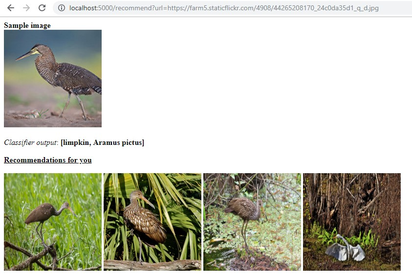

E-Commerce Use Case
===================
In this use case, we will build a recommendations engine that can be used for recommending items to customers, based on what they look at. This is just to demonstrate the integration of EuclidesDB into different systems.

Here, we will use a flask web application to work on an image URL to classify it through EuclidesDB, serving a ResNet18 model. We will use a simple docker container that already contains a ResNet18 model serving on the specified port.

To run the app you should have the following softwares installed:

1. `Python (2 or 3) <https://www.python.org/downloads/>`_
2. `PyTorch <https://pytorch.org/get-started/locally/>`_
3. `Docker <https://docs.docker.com/install/#supported-platforms>`_
4. `Git <https://www.linode.com/docs/development/version-control/how-to-install-git-on-linux-mac-and-windows/>`_

Running the Application
-----------------------

A. Run the EuclidesDB from the docker container:

.. code-block:: shell

   docker run -p 8000:50000 -it --name euclidesdb euclidesdb/euclidesdb

B. Clone the repository

.. code-block:: shell

   git clone https://github.com/ShamsUlAzeem/euclides-test-docs.git

C. Switch directories

.. code-block:: shell

   cd euclides-test-docs/use-cases/e-commerce

D. Install the python dependencies

.. code-block:: shell

   pip install -r requirements.txt

E. Run the app

.. code-block:: shell

   python app.py

Testing the Application
-----------------------

The *EuclidesDB* server would be running on port `8000` on `localhost`, serving **ResNet18**, while the flask web application would be running on port `5000`. To interact with the application, navigate to the following url:

``http://localhost:5000/recommend?url=<your_image_url>``

Replace ``<your_image_url>`` with an image URL you wanna get recommendations for. For example, ``http://localhost:5000/recommend?url=https://farm5.staticflickr.com/4908/44265208170_24c0da35d1_q_d.jpg``. The app will load the image, run it through the classifier and get recommendations for you via the flickr API.

SAMPLE
---------

A working application would produce results like the following:

