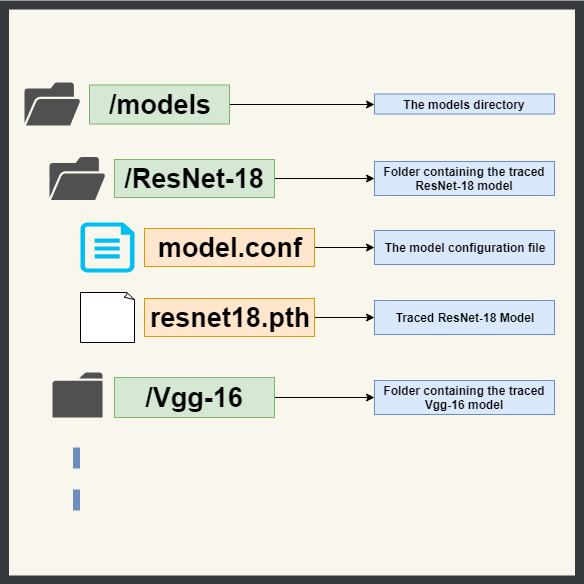

This walkthrough will guide your through the :ref:`installation` and :ref:`configuration` process for setting up *EuclidesDB*.

.. _installation:

============
Installation
============

Pre-requisites
--------------
Before installing *EuclidesDB*, make sure you have an appropriate version of `PyTorch <https://pytorch.org/get-started/locally/>`_ installed on your system. It is required for `saving <https://pytorch.org/tutorials/beginner/saving_loading_models.html>`_ your custom models for configurations inside *EuclidesDB*.

.. _all-os:

All Operating Systems
---------------------
The easiest and quickest way to get *EuclidesDB* up and running is through a `Docker <https://docs.docker.com/install/>`_ container. To start a *EuclidesDB* container execute the following commands in a terminal:

.. code-block:: shell

    docker volume create --name edb
    docker run -p 50000:50000 --mount source=edb,target=/database -it --name euclidesdb euclidesdb/euclidesdb

This will create a docker `volume <https://docs.docker.com/storage/volumes/>`_ to save the default database configurations and start the *EuclidesDB* server, serving a pre-configured PyTorch ResNet-18 model with the DB.

.. note::

    If the database doesn’t exists, it will be created by EuclidesDB on the first run.

Linux
-----
To install *EuclidesDB* on a Linux systems, download the `latest Linux release <https://github.com/perone/euclidesdb/releases>`_ from the github repository, extract it and run the database server as follows:

.. code-block:: shell

    wget https://github.com/perone/euclidesdb/releases/download/v0.1.1/euclidesdb-0.1.1-Linux.tar.gz
    tar zxvf euclidesdb-0.1.1-Linux.tar.gz
    cd euclidesdb
    ./euclidesdb -c euclidesdb.conf

.. note::

    At the time of this writing, the latest version was `0.1.1`. See the :ref:`configuration` section for more details about the `euclidesdb.conf` file.

The Linux tarball distributions comes with all the dependencies packaged to work out of the box.

Mac OS
------
To install EuclidesDB in MacOS, the best approach is to install dependencies using `homebrew <https://brew.sh/>`_ as shown below:

.. code-block:: shell

    brew install grpc
    brew install leveldb
    brew install libomp

Download the `latest Mac OS release <https://github.com/perone/euclidesdb/releases/latest>`_  and install it:

.. code-block:: shell

   curl -L -o 'euclidesdb-0.1.1-Darwin.dmg' 'https://github.com/perone/euclidesdb/releases/download/v0.1.1/euclidesdb-0.1.1-Darwin.dmg'
   hdiutil attach euclidesdb-0.1.1-Darwin.dmg
   cp -R /Volumes/euclidesdb-0.1.1-Darwin\euclidesdb .
   hditutil detach /Volumes/euclidesdb-0.1.1-Darwin/
   cd euclidesdb
   ./euclidesdb -c euclidesdb.conf

.. note::

    At the time of this writing, the latest version was `0.1.1`. See the :ref:`configuration` section for more details about the `euclidesdb.conf` file.

Windows
-------
For windows, *EuclidesDB* can only be used through a docker container. Please refer to :ref:`all-os`.

------------

.. _configuration:

=============
Configuration
=============
EuclidesDB configurations can be contains in any file. Usually it is named `euclides.conf`. There are two types of configurations for *EuclidesDB*:

1. Server configurations
2. Models configurations

1. Server Configurations
------------------------

The server configuration file contains different knobs for configuring the server itself, which can contain configurations for database and models directories, path for log files and the database serving address. Let's look at a sample server configuration file:

.. code-block:: ini

    [server]
    address = 127.0.0.1:50000
    log_file_path = /home/user/euclidesdb/logfile.log
    search_engine = annoy

    [annoy]
    tree_factor = 2

    [models]
    dir_path = /home/user/euclidesdb/models

    [database]
    db_path = /home/user/euclidesdb/database

.. note::

   Remember to always use **absolute paths** in EuclidesDB configuration files.

There are four different partitions for the server configuration file:

A. Server partition
B. Search engine partition
C. models partition
D. database partition

A. Server Partition
~~~~~~~~~~~~~~~~~~~
- ``server.address``: The address server will use to listen. If you with to listen on all interfaces, please use the IP ``0.0.0.0`` and the `port` you want to use, in the format ``0.0.0.0:<port>``.
- ``server.log_file_path``: This is the path for logging file. Logging output to *stdout* as well.
- ``server.search_engine``: The search engine to use. Possible values are: ``annoy``, ``faiss`` or ``exact_disk``. Configuration for each search engine is described in :ref:`search_engine_partition` section.

.. note::

   Remember to always use **absolute paths** in EuclidesDB configuration files.

.. _search_engine_partition:

B. Search Engine Partition
~~~~~~~~~~~~~~~~~~~~~~~~~~
EuclidesDB comes with many different search engines. To choose the search engine, set the ``search_engine`` configuration parameter in the ``server`` section of the configuration file. This parameter will specify which search engine EuclidesDB will use for index/search.

The ``search_engine`` can have one the following values:

* ``annoy``: uses the `Annoy <https://github.com/spotify/annoy>`_ indexing/search method;
* ``exact_disk``: uses EuclidesDB *on-disk* (as opposing to in-memory) linear exact search;
* ``faiss``: uses the `Faiss <https://github.com/facebookresearch/faiss>`_ indexing/search methods;

Each one of these search engines has their pros and cons. For example, ``faiss`` can provide you a wide spectrum of index methods that differs in performance by search time, search quality, memory and training time.

The configurations for each type of search is as follows:

Annoy Configuration
^^^^^^^^^^^^^^^^^^^^^^^^^^^^^^^^^^^^^^^^^^^^^^^^^^^^^^^^^^^^^^^^^^^^^^^^^^^^^^^
The Annoy search engine configuration accepts only one parameter, called `tree_factor`. This parameter can be specified in the EuclidesDB configuration as:

.. code-block:: ini

    [server]
    (...)
    search_engine = annoy

    [annoy]
    tree_factor = 2

    (...)

This number is multiplied by the model space feature size (512 for ResNet8 for example). The default value is 2, which means that if you have a model space with 512 features, the index will use 1024 trees. A higher `tree_factor` gives higher precision when querying.

.. note:: For more information regarding how Annoy works, please refer to `Annoy documentation <https://github.com/spotify/annoy#how-does-it-work>`_ or an `excellent presentation <https://www.slideshare.net/erikbern/approximate-nearest-neighbor-methods-and-vector-models-nyc-ml-meetup>`_ from Erik Bernhardsson.

Exact-disk Configuration
^^^^^^^^^^^^^^^^^^^^^^^^^^^^^^^^^^^^^^^^^^^^^^^^^^^^^^^^^^^^^^^^^^^^^^^^^^^^^^^
The search engine ``exact_disk`` is a very simple and exact search engine. It will iterate over all items in the database (on the disk, hence the name ``exact_disk``) and it will calculate the distance between the query and all items.

A configuration example is shown below:

.. code-block:: ini

    [server]
    (...)
    search_engine = exact_disk

    [exact_disk]
    pnorm = 2
    normalize = false

    (...)

A descripton of each parameter is shown below:

* ``pnorm``: This is the `p-norm <https://en.wikipedia.org/wiki/Lp_space>`_ used to calculate the distance between a pair of items, the default value is 2 (euclidean distance);
* ``normalize``: When ``true``, it will normalize feature vectors before doing the comparison. If you use ``pnorm = 2`` and ``normalize = true``, you'll recover cosine similarity.

Faiss Configuration
^^^^^^^^^^^^^^^^^^^^^^^^^^^^^^^^^^^^^^^^^^^^^^^^^^^^^^^^^^^^^^^^^^^^^^^^^^^^^^^
The ``faiss`` search engine is perhaps the one that offers the largest amount of indexing types. A configuration example is shown below:

 .. code-block:: ini

    [server]
    (...)
    search_engine = faiss

    [faiss]
    metric = l2
    index_type = Flat

    (...)

The ``faiss`` search engine has two parameters: ``metric`` and the ``index_type``, however, the ``index_type`` can also be complimented other parameters to build the index according to some patterns.

Here is a description of each parameter:

- ``metric``: If this equals to ``l2`` (default), it will use the euclidean distance. If this parameter is equal to ``inner_product`` it will use the inner-product for the distance;
- ``index_type``: This specify the `index factory string <https://github.com/facebookresearch/faiss/wiki/Faiss-indexes>`_ from Faiss. For instance, a ``Flat`` value will build an index that uses brute-force L2 distance for search. If this parameter contains the value ``PCA80,Flat`` the search engine will produce an index by applying a PCA to reduce it to 80 dimensions and then an exhaustive search.

.. note:: For more information regarding the Faiss index types and index factory strings, please refer to the `Faiss summary of indexes <https://github.com/facebookresearch/faiss/wiki/Faiss-indexes>`_ or `Faiss index factory tutorial <https://github.com/facebookresearch/faiss/wiki/Index-IO,-index-factory,-cloning-and-hyper-parameter-tuning#index-factory>`_. If you are unsure about which index to use, please take a look at `Guidelines to choose an index <https://github.com/facebookresearch/faiss/wiki/Guidelines-to-choose-an-index>`_.

C. Models Partition
~~~~~~~~~~~~~~~~~~~
- ``models.dir_path``: This is the models directory path.

After the directory specification, the further model configurations are specified in another file named `model.conf`. This configuration specifies which model to server along with a bunch of other configurations and is contained inside every model's folder. For more details about this configuration file refer to the :ref:`model-config` section.

.. note::

   Remember to always use **absolute paths** in EuclidesDB configuration files.

D. Database Partition
~~~~~~~~~~~~~~~~~~~~~

- ``database.db_path``: This is the directory path for the database storage. *EuclidesDB* uses a key-value database based on `LevelDB <http://leveldb.org/>`_ to store all features from each item added into the database.

.. note::

   Remember to always use **absolute paths** in EuclidesDB configuration files.

.. _model-config:

2. Models Configurations
------------------------
The models are structured in a folder hierarchy where each sub-folder of the models directory contains a PyTorch `traced module <https://pytorch.org/docs/master/jit.html>`_ file together with the ``model.conf`` (model configuration) file. The directory structure looks like the following:

The model configuration file must be named **model.conf** and should follow the format below:

.. code-block:: ini

    [model]
    name = resnet18
    filename = resnet18.pth
    prediction_dim = 1000
    feature_dim = 512

As you can see, this file contains settings related to the model itself. Each of the configuration item is described below:

 - ``model.name``: This is the name of the model that will be used for the EuclidesDB calls when you want to query an index or add a new item. A good practice is to use the same name as the folder.
 - ``model.filename``: This is the serialized traced module filename, it is the output of the PyTorch tracing.
 - ``model.prediction_dim``: this is prediction dimension of your model (number of output classes). Since EuclidesDB stores the final prediction layer as well as model features, you should provide the dimension of the prediction classes. For example, in a model trained on ImageNet, this will be 1000, meaning that there are 1000 prediction classes;
 - ``model.feature_dim``: this is feature dimension of your model, depending on your model this will have a different size. For the VGG-16 module for instance, this will be 4096, meaning that there is a 4096-dimension vector for the features. As you can note, this should be a flattened vector no matter what model you use. This can also be thought as the size of the input vector when flattened.

